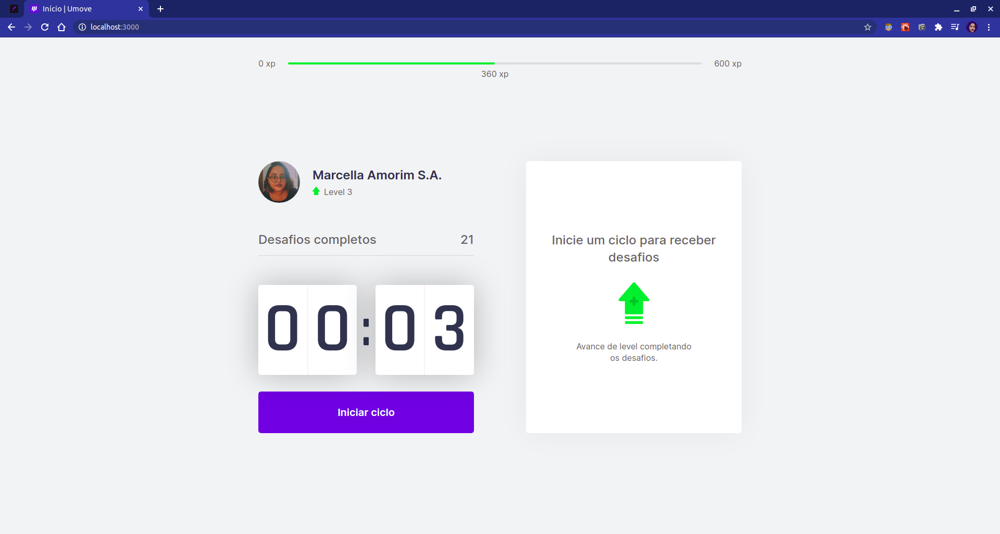
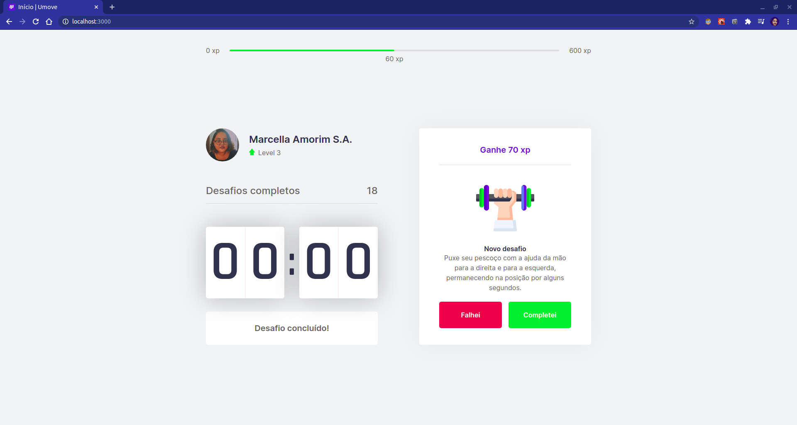

<h1 align="center">Umove</h1>
<h5 align="center"> 🚀NLW#4 | Trilha React </h5>

### 💡O que é Umove?

Esse é um projeto feito em ReactJS com NextJS. O objetivo é ser uma ferramenta para incentivar pessoas que passam muito tempo no computador a se exercitar para evitar problemas de saúde. Usa um sitema de  gamificação e a técnica de Pomodoro. Ao fim de cada período é proposto um desafio e conforme o cumprimento, ou não, você ganha pontos.

## 📺  Interface ⚒️

